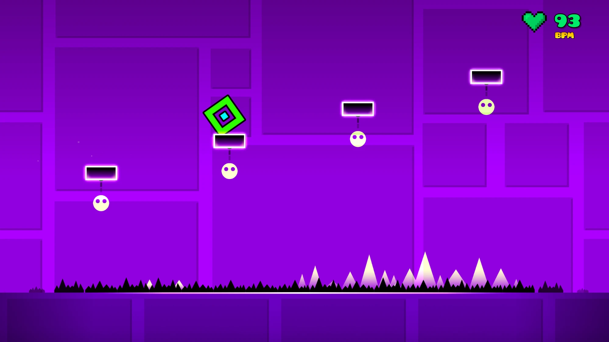
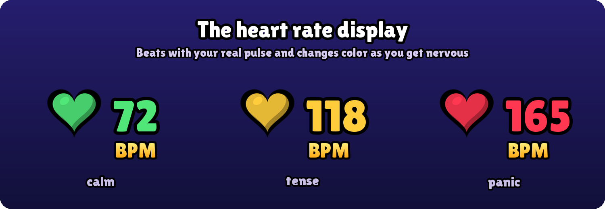
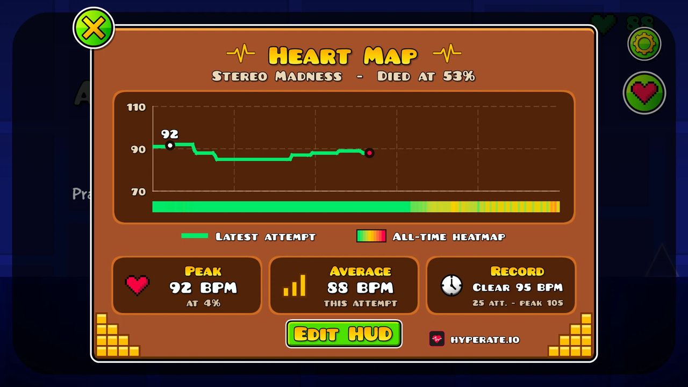
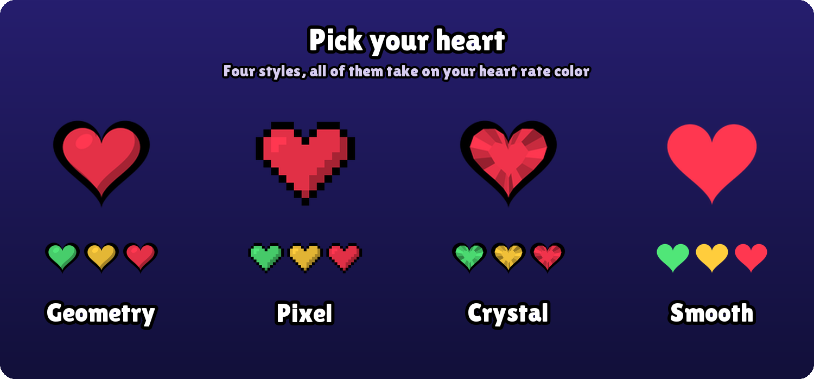

# HypeRate for Geometry Dash

Ever wondered what your heart does on that one jump at 94%? Now you can see it.

This is the official [HypeRate](https://www.hyperate.io) mod for Geometry Dash. It puts your live heart rate right into the game, and after a few attempts it shows you exactly where in a level you start to panic. It runs on [Geode](https://geode-sdk.org) and works on Windows, macOS, Android and iOS.



## What it does

**Your heart rate while you play.** A little heart in the corner beats along with your real pulse and slowly turns from green to red as things get tense. What counts as tense is up to your own heart: while you play, the mod learns your normal heart rate and sets the colors around it. You decide where it sits and how big it is. Hit the heart button in the pause menu, then *Edit HUD*, and drag it wherever you like. No signal? It just fades out and comes back once your watch or strap is sending again.



**The Heart Map.** This is the part we're most excited about. Every attempt gets recorded against your progress through the level, so you end up with a curve of your pulse from 0 to 100%. There's also a colored strip under the progress bar that builds up over time: after a while you can literally see which part of a level gets to you. The mod also remembers your best run, your highest heart rate and your calmest clear for every level. All of that stays on your own device.



**Ice Cold Mode.** For the brave ones: set a heart rate limit and if you go over it, you die. It only ever makes the game harder, never easier. Good luck with that wave part.

**Pick your heart.** There are four heart styles to choose from in the settings (we're partial to the pixel one). All of them change color with your heart rate.



A few smaller things: a demo mode so you can try everything without a sensor, and a live connection status right in the settings.

## Getting started

1. Get the HypeRate app and connect your smartwatch, fitness band or chest strap.
2. Install the mod from the Geode mod list in Geometry Dash.
3. Open the mod settings, paste your HypeRate ID and press *Apply*. The status line underneath turns green once your heart rate comes in.

That's it. If something doesn't work, come say hi on our [Discord](https://discord.gg/wQZu5HunUF).

## Privacy

The mod only *receives* your heart rate from HypeRate using your ID. It doesn't send anything about your gameplay anywhere. Your level stats live in a file in Geode's save folder on your device and nowhere else.

---

## For developers

The mod is written in C++ with the Geode SDK. If you want to build it yourself:

```bash
geode build
```

You'll need the [Geode CLI and SDK](https://docs.geode-sdk.org/getting-started/), CMake and Ninja. Every push also builds all platforms through GitHub Actions (`.github/workflows/build.yml`).

**API key.** Connecting to HypeRate needs an API key, which we never commit. The build picks it up from `-DHYPERATE_API_KEY=...`, the `HYPERATE_API_KEY` environment variable (that's how CI gets it, as a repository secret) or a local, gitignored `api-key.txt`. Without one the mod still builds, it just can't connect. Want your own key for a fork or your own project? Have a look at the [HypeRate API](https://www.hyperate.io/api).

**Where things are.** `HypeRateClient` handles the WebSocket connection. `HeartMap` and `LevelStats` record attempts and save them. Everything you see in-game lives in `src/ui`, and the hooks into the game itself are in `src/hooks`.

**Built with** [IXWebSocket](https://github.com/machinezone/IXWebSocket) (BSD-3), [mbedTLS](https://github.com/Mbed-TLS/mbedtls) (Apache-2.0, Windows and Android only) and Mozilla's CA bundle from [curl.se](https://curl.se/docs/caextract.html) (MPL-2.0, Android only).
